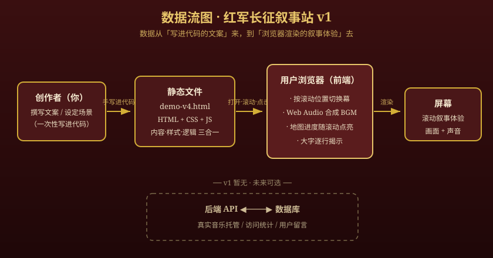

# 技术设计｜红军长征叙述性网站（v1）

> 这份文档是 Day 5 的交付物，配合 `PRD.md` 一起看。PRD 讲"做成什么样"，这份讲"用什么技术、数据怎么流动"。目标读者：你（项目主人）和 AI（施工队），都要逐字读懂——我会把术语当场用大白话解释。

---

## 0. 一句话（今天要掌握的）

> **这个网站的数据，从「我写进代码里的文案与场景」来，到「用户浏览器里渲染出的滚动叙事 + 声音」去。**
> v1 阶段**没有后端、没有数据库**，用户不产生需要被存储的数据。

这句话就是今天的全部学习目标：用一句人话，说清数据"从哪来、到哪去"。

---

## 1. 前后端与数据库分工（先搞清三个词）

用大白话解释这三个容易混的词：

- **前端**：跑在用户设备（浏览器）上的代码。决定用户「看到什么、页面怎么动、点了有什么反应」。本项目 v1 的一切都在前端。
- **后端**：跑在服务器上的程序。负责「存数据、算数据、把数据传给前端」。本项目 v1 **没有**后端。
- **数据库**：专门「长期存数据」的地方（比如用户账号、留言、访问统计）。本项目 v1 **没有**数据库。

**本项目 v1 的分工表：**

| 角色  | 有没有  | 谁来做                  | 说明                           |
| --- | ---- | -------------------- | ---------------------------- |
| 前端  | ✅ 有  | 浏览器跑 HTML / CSS / JS | 内容展示、滚动叙事、场景动效、地图进度、音频播放，全在这 |
| 后端  | ❌ 暂无 | —                    | 内容是静态的，不需要服务器处理              |
| 数据库 | ❌ 暂无 | —                    | 用户只是看和滚，没有要存回服务器的数据          |

**为什么 v1 敢不做后端？** 因为这站是"只读展示"：内容由你一次性写好、写死在代码里，用户只是观看、滚动，不产生需要回传保存的东西。这正好满足 PRD §7 砍掉项里的"不接后端"，也满足验收 A6「纯前端单文件」。

> 未来如果要做"真实音乐文件托管 / 访问统计 / 用户留言 / 账号"，那时才需要后端 + 数据库。那是后话，**不在 v1**。

---

## 2. 技术路线（含理由）

> 技术路线一句话：**原生 HTML + CSS + JS 的单文件静态站，零框架、零后端，静态托管即可上线。**

> 说明：本阶段按 Day 5「卡住降级」条款走——采用**示范路线**，不做多方案比较。理由是 PRD 已明确"单文件纯前端"，且 Day 4 的 `demo-v4.html` 已验证"原生够用"。

| 维度      | 选择                                                       | 为什么选它（理由）                                               |
| ------- | -------------------------------------------------------- | ------------------------------------------------------- |
| 整体形态    | **单文件静态站点**（一个 `.html` 同时含 HTML + CSS + JS）              | PRD §6 要求"单文件 HTML + 纯 CSS/JS"；双击即开、任意静态托管、零构建步骤        |
| 前端语言    | **原生 HTML + CSS + 原生 JavaScript（不引框架）**                  | 叙事站不需要组件化框架；单文件约束下框架反而是负担；`demo-v4.html` 已验证原生足够出惊艳效果   |
| 动效方案    | **CSS 动画 + SVG 图形 + 少量 JS**（滚动监听 / IntersectionObserver） | 皮影剪影、鼠标视差、逐行文字揭示、地图描线纯原生就能做；与 PRD §4.5"先纯前端，效果不好再加重型"一致 |
| 音频      | **Web Audio API 现场合成**（`demo-v4` 已验证）；后续可换真实音频文件         | 单文件、零外部资源；用一次性引导页点击解锁音频（方案甲），绕开浏览器"禁止自动播放声音"的限制         |
| 字体      | **系统衬线字体**（宋体 / Noto Serif SC）                           | 保证单文件、无外部字体加载、各设备稳定显示                                   |
| 部署 / 托管 | **静态托管**（GitHub Pages / Vercel / 任意静态空间）                 | 无后端 → 部署极简，上传文件即上线                                      |
| 本地开发    | 文本编辑器 + 浏览器即可；**可选** Vite 起本地服务器                         | 单文件阶段不需要构建工具；Vite 留作未来需要模块化时再用                          |

**为什么"暂时"选这条（降级说明）：** 本阶段不比较多套方案，直接选最轻的示范路线，依据是 PRD「纯前端单文件」+ Day 4 已验证原生够用。等出现以下信号再升级：

- 动效复杂到原生难维护 → 引入 GSAP / Lenis 等动效库；
- 要真实数据或存储（统计 / 留言 / 账号）→ 引入 Node/Express + 数据库；
- 要多人协作或模块化 → 引入构建工具（Vite）甚至框架（React）。

等于一句话：**先证明叙事成立，再决定技术投入。**

---

## 3. 数据流图

> 这张图回答"数据从哪来、到哪去"。实线是 v1 真实链路；**虚线框是 v1 暂无、未来可选**的部分。



（上图是矢量图，深色背景上金线描边。若你的阅读器不显示图片，下面有等价的文字版，任何 Markdown 阅读器都能看。）

```
        ┌──────────────┐
        │  创作者（你）  │   撰写文案 / 设定场景 / 选配色
        └──────┬───────┘
               │ 手写进代码（一次性）
               ▼
        ┌────────────────────────┐
        │  静态文件 demo-v4.html  │   内容 + 样式 + 逻辑 三合一
        │  （HTML + CSS + JS）    │
        └──────────┬─────────────┘
                   │ 用户打开网页 / 滚动 / 点"开始体验"
                   ▼
        ┌────────────────────────┐
        │   用户浏览器（前端）     │   JS 按滚动位置切换幕
        │                        │   Web Audio 合成 BGM
        │                        │   地图进度随滚动点亮
        └──────────┬─────────────┘
                   │ 渲染
                   ▼
        ┌────────────────────────┐
        │   屏幕：滚动叙事体验     │   画面 + 声音 + 进度提示
        │  （用户只看、不写回）    │
        └────────────────────────┘

   ── v1 暂无（虚线 = 未来可选）──
        ┌──────────┐        ┌──────────┐
        │  后端 API │ ◀────► │  数据库   │   真实音乐托管 / 访问统计 / 留言
        └──────────┘        └──────────┘
```

**一句话读图：** 数据从「你写进代码的文案」出发，在「用户浏览器」里被渲染成叙事体验，终点就是「屏幕上的画面与声音」；没有任何数据需要回传到服务器。

---

## 4. 余力加练 1：方案变化时哪些文件会受影响

| 假设的变化            | 受影响文件                                             | 影响程度 / 怎么改      |
| ---------------- | ------------------------------------------------- | --------------- |
| 改文案 / 金句         | `demo-v4.html` 里的文案段（`<section class="copy">` 区域） | 小：只改文字，不动结构     |
| 加 / 减一幕场景        | 场景 SVG 段 + 脚本里的"幕数组"和地图节点数组                       | 中：画面加一处，数组同步加一处 |
| 换整体配色 / 调性       | CSS 里的 `:root` 配色变量                               | 小：改几行变量即可全局换色   |
| 把合成 BGM 换成真实音频文件 | 去掉 Web Audio 合成，改用 `<audio src="...">`            | 中：音频模块替换        |
| 引入动效库（如 GSAP）    | 仍是单文件，但引入库（CDN 或打包）                               | 中：动效代码改写        |
| 加后端 + 数据库        | 新增 `server/` 目录、前端加 `fetch` 调用、新增数据库配置            | 大：架构级改动         |
| 改用框架（如 React）    | 基本重写页面结构                                          | 大：结构级重写         |

---

## 5. 余力加练 2：什么是"技术栈"（科普）

做网页 / App 通常会碰到这几类技术，各自管不同的事：

- **前端技术栈**：浏览器三件套 —— **HTML**（页面结构）、**CSS**（样式外观）、**JavaScript**（交互行为）。上面可以再盖框架（React / Vue）来组织复杂代码；动效库（GSAP）、3D 库（Three.js）是可选增强。
  - 优势：直接面向用户、改了立刻能看到、迭代快。
  - 劣势：受浏览器兼容性和设备性能限制。
- **后端技术栈**：跑在服务器上的语言 + 框架，如 Node.js/Express、Python/Django、Go 等，负责业务逻辑、算数据、提供接口（前端去找它要数据）。
  - 优势：能存数据、能做重计算、能控权限。
  - 劣势：要部署、要运维、要防安全问题。
- **数据库**：关系型（MySQL / PostgreSQL）适合规整表格；文档型（MongoDB）适合灵活结构。
  - 优势：把数据持久存下来，下次还能用。
  - 劣势：要设计表结构、要维护。
- **托管 / 部署**：静态托管（GitHub Pages / Vercel / Netlify）适合无后端项目；云服务器 / 容器适合有后端项目。

本项目 v1 只用「前端最小子集（HTML + CSS + JS）」，所以技术栈极轻——这正是 PRD「纯前端」的直接体现。

---

## 6. 与 PRD / research 的关系

- 本文件是 PRD §6「正式技术选型留到 Day 5」的落地答案。
- 采纳了 `research.md` 里"允许后续不止单文件、可升级精致 3D"的开放态度，但 v1 先守"纯前端单文件"。
- 砍掉的"后端 / 数据库 / 主界面"在本文件里落实为：v1 确实没有它们，数据流图用虚线标注其未来位置。
